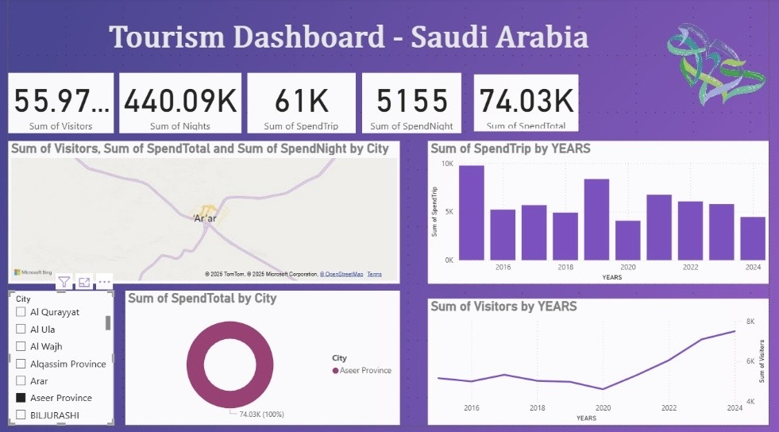

# 🏛️Saudi Tourism Analysis

## 📌 Project Overview
This project analyzes hotel pricing and performance using Power BI to identify overpriced, underpriced, and high-value hotels.

The dashboard helps support pricing strategy decisions through interactive visualizations and KPI tracking.

---

## 🛠 Tools Used
- Power BI
- Power Query
- DAX
- Excel

---

## 📊 Key Features
- Price Difference % calculation
- Overpriced vs Underpriced classification
- Best Value identification
- Interactive dashboard
- KPI cards and visual analytics

---

## 📈 Business Goals
- Analyze hotel pricing performance
- Identify hotels with low ratings and high prices
- Support better pricing decisions
- Improve customer value analysis

---
## 🔍 Key Insights
- Some hotels had high prices despite low ratings
- Several hotels offered strong value for money
- Pricing inconsistencies were identified across different hotels

---

## 📷 Dashboard Preview

---

## 🚀 Future Improvements
- Add geographic hotel analysis using maps
- Include time-based trend analysis
- Add customer segmentation insights